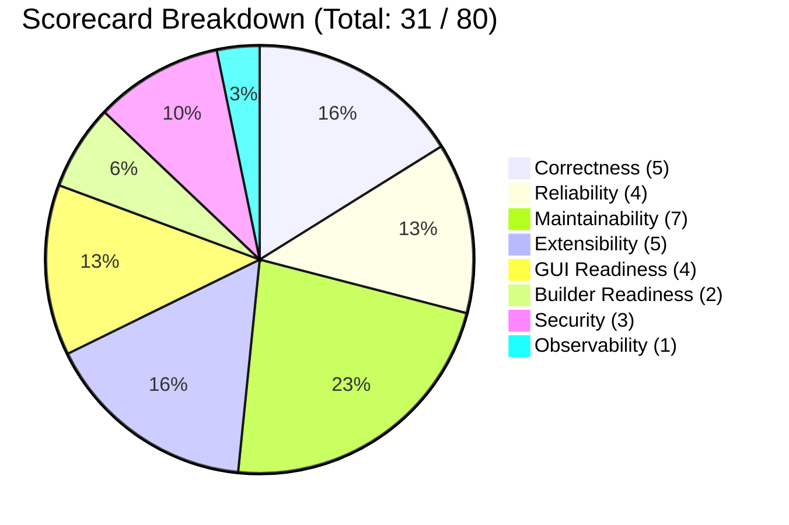

# Engine Readiness Scorecard: AWIS Beta Release Candidate

**Date:** 2026-09-03  
**Auditor:** Adversarial Release Verification Team  
**Evaluation Scope:** Core Engine, Storage Layer, Runners, API, and GUI Integration  
**Methodology:** Evidence-backed evaluation based on authoritative code, runtime behavior, and schema analysis (Tier 1 Evidence).

---

## 1. Scorecard Summary

| Dimension | Score (1-10) | Rating | Primary Evidence / Justification |
|---|:---:|:---:|---|
| **Correctness** | **5 / 10** | **POOR** | In-flight step recovery deadlocks instances; non-final branch stalls hang in `running`; signal deliveries trigger sequence retry races. |
| **Reliability** | **4 / 10** | **CRITICAL** | Volatile in-memory cancellation loses compensation on restart; crash recovery fails for active steps; single SQLite connection bottleneck. |
| **Maintainability** | **7 / 10** | **ACCEPTABLE** | Clean architecture; strong standard Go idioms; strict dependency control (only 2 direct external dependencies). |
| **Extensibility** | **5 / 10** | **POOR** | Frozen 12-method `StoragePort` forces awkward type assertions across packages; definition schema lacks namespacing in PK. |
| **GUI Readiness** | **4 / 10** | **POOR** | Read-only only; `ORDER BY ASC` displays oldest 50 instances on dashboard; infinite polling on terminal instances; hash router drops query params. |
| **Builder Readiness**| **2 / 10** | **DEFICIENT** | Zero write API; zero YAML serializer; immutable definitions; strict DAG rejects iterative loop constructs. |
| **Security** | **3 / 10** | **UNACCEPTABLE** | Subprocess steps inherit host environment and leak `ANTHROPIC_API_KEY`; unauthenticated HTTP listener; arbitrary process execution. |
| **Observability** | **1 / 10** | **DEFICIENT** | Zero Prometheus/OTel metrics; zero distributed tracing; static mock `/healthz` check that ignores DB/engine status. |
| **OVERALL** | **3.9 / 10** | **NOT READY** | **Candidate Rejected for Beta Release.** |

---

## 2. Detailed Dimension Evaluations

### 2.1 Correctness: 5 / 10 (POOR)
- **Strengths:**
  - Event sourcing append-only log with strict monotonic sequence checking (`AppendEvent` in `internal/storage/sqlite.go:92-163`).
  - Optimistic concurrency control (`version` column) on instance updates (`UpsertInstance` in `internal/storage/sqlite.go:475-600`).
  - Valid DAG cycle detection at validation time (`internal/validate/validate.go:534-565`).
- **Defects & Evidence:**
  - **In-Flight Step Zombie State:** If a step is running when the engine terminates, `hydrate()` (`internal/engine/hydrate.go:105-124`) never resumes it or marks it failed. `activatableFor()` (`internal/engine/failure.go:133`) skips it because it remains in `CurrentSteps`. The instance deadlocks permanently in `status: "running"`.
  - **Silent Stalls on Non-Final Branches:** If an error/fallback branch executes and completes, but is not listed in `final_steps`, `completedFinalOutputs` (`internal/engine/transition.go:135`) returns empty. `tick.go:206` returns `nil`, leaving the instance in `status: "running"` with `CurrentSteps: []` indefinitely.
  - **Signal Delivery Sequence Skew:** `DeliverSignal` (`internal/storage/deliver.go:142-158`) assigns a new `sequence_num` directly in SQL. The in-process engine's `e.seq` cache is not updated, guaranteeing that the engine's next event append will trigger an `ErrSequenceViolation` and require a compensatory database roundtrip (`internal/engine/emit.go:143-159`).

---

### 2.2 Reliability: 4 / 10 (CRITICAL)
- **Strengths:**
  - SQLite WAL journal mode and `PRAGMA synchronous=NORMAL` provide ACID durability (`internal/storage/db.go:108-118`).
  - `_txlock=immediate` DSN option eliminates deferred lock upgrade deadlocks (`internal/storage/db.go:97-103`).
- **Defects & Evidence:**
  - **Volatile Cancellation State:** `Cancel()` records `reason` and `compensate` only in `e.cancels` (`internal/engine/cancel.go:129-132`). A restart during cancellation resets this map, causing `finalizeCancellation` (`internal/engine/cancel.go:204-215`) to silently bypass compensation and drop the cancellation reason.
  - **Single Connection Starvation:** `sqlDB.SetMaxOpenConns(1)` in `internal/storage/db.go:42` means HTTP requests and engine execution ticks share a single connection. Heavy dashboard polling or event list queries block the 100ms engine tick.
  - **Non-Recoverable Claims:** `step_claims` entries have no expiration timestamp (`migrations/0001_core_execution.sql:43-49`). A crashed worker leaves an unexpiring claim that prevents any other worker or restart process from executing the step.

---

### 2.3 Maintainability: 7 / 10 (ACCEPTABLE)
- **Strengths:**
  - Zero bloated frameworks: minimal third-party dependencies (`gopkg.in/yaml.v3` and `modernc.org/sqlite` only, as verified in `go.mod`).
  - Comprehensive unit test coverage for happy paths and linear sequential flows (`go test ./...` passes in ~75s).
  - Clear separation of core types (`internal/core`), storage interfaces, execution engine, and CLI.
- **Defects & Evidence:**
  - High duplication between `cmd/awis/status.go` and `internal/api/instances.go` (wait record extraction).
  - Uncommitted changes across 7 tracked files and 5 untracked directories (`cmd/awis-server`, `internal/api`, `internal/buildinfo`, `web`, `docs/09-gui-planning`).

---

### 2.4 Extensibility: 5 / 10 (POOR)
- **Strengths:**
  - Pluggable runner model via `Runner` interface (`core.StepType` dispatch map in `internal/engine/engine.go:112`).
  - Modular plugin architecture with JSON-RPC 2.0 transport (`internal/plugin/`).
- **Defects & Evidence:**
  - **Frozen `StoragePort` Anti-Pattern:** The 12-method `StoragePort` (`internal/core/ports.go`) was prematurely frozen. Almost every subsystem now circumvents it via dynamic type assertions:
    - `cancellationStore` (`internal/engine/cancel.go:25`)
    - `eventsPagedStore` (`internal/api/events.go:19`)
    - `waitRecordStore` (`internal/api/instances.go:107`)
    - `instanceVersionStore` (`internal/engine/emit.go:196`)
    - `signalWaitStore` (`internal/engine/signal_timeout.go:17`)
  - **Broken Namespace Primary Key:** `workflow_definitions` has `PRIMARY KEY (id, version)` (`migrations/0001_core_execution.sql:18`). Two namespaces cannot register the same workflow ID and version, blocking multi-tenant extensibility.

---

### 2.5 GUI Readiness: 4 / 10 (POOR)
- **Strengths:**
  - Lightweight lit-html UI compiles into a static 44KB bundle with zero heavy framework overhead (`web/build.mjs`).
  - Live connection indicator accurately reflects backend reachability (`web/src/main.ts:73-104`).
- **Defects & Evidence:**
  - **Inverted Dashboard Pagination:** `ListInstancesPaged` orders by `started_at, instance_id ASC` (`internal/storage/sqlite.go:812`). The landing page fetches offset 0 and client-sorts the 50 oldest workflows. Any newly running workflow is invisible on the dashboard in systems with >50 instances.
  - **Infinite Polling on Terminal Workflows:** `instanceDetail.ts:68-85` polls `GET /api/v1/instances/:id` every 15 seconds even when the workflow has completed, failed, or cancelled, generating pointless SQLite connection contention.
  - **Router Query Stripping:** `web/src/router.ts:25, 50` drops query strings (e.g. `#/instances?status=running`), redirecting to `#/instances` and breaking filter bookmarking and deep-linking.

---

### 2.6 Builder Readiness: 2 / 10 (DEFICIENT)
- **Strengths:**
  - `Metadata["ui"]` map can store arbitrary visual coordinates (`Metadata.ui.positions`).
- **Defects & Evidence:**
  - **Zero Write/Save API:** `internal/api/router.go` exposes no HTTP mutation endpoints (`POST`, `PUT`, `PATCH`). Workflows cannot be created or edited via HTTP.
  - **Complete Lack of YAML Serializer:** Workflows are defined in YAML, but `yaml.Marshal` is called zero times across the codebase. There is no code to serialize AST nodes back to YAML files on disk.
  - **Workflow Definition Immutability:** `RegisterWorkflow` (`internal/storage/sqlite.go:327`) returns `ErrAlreadyRegistered` on duplicate `(id, version)`. There is no concept of drafts, staging, or in-place updates.
  - **Cycle Rejection Precludes Loops:** `internal/validate/validate.go:83` strictly rejects cycles. Combined with `PRIMARY KEY (instance_id, step_id)` in `step_claims`, iterative loop nodes (a staple of n8n builders) are architecturally impossible without engine changes.

---

### 2.7 Security: 3 / 10 (UNACCEPTABLE)
- **Strengths:**
  - SQLite parameter binding used across all database queries, preventing SQL injection.
  - Loopback default binding (`127.0.0.1:8090`) for `awis-server`.
- **Defects & Evidence:**
  - **Subprocess Environment Secret Leak:** `internal/runner/subprocess/subprocess.go:125` leaves `cmd.Env = nil`, leaking `ANTHROPIC_API_KEY` and host environment to all subprocess steps.
  - **Arbitrary Command Execution:** Subprocess runner splits handler strings via `strings.Fields` with no path whitelist, allowing execution of any binary available to the host user.
  - **No Authentication/Authorization:** `cmd/awis-server` provides no API tokens, mTLS, or session auth.

---

### 2.8 Observability: 1 / 10 (DEFICIENT)
- **Strengths:**
  - Structured logging via stdlib `log/slog` in JSON format.
- **Defects & Evidence:**
  - **Zero Telemetry Stack:** No Prometheus `/metrics`, OpenTelemetry spans, or `expvar` instrumentation.
  - **Fake Healthcheck:** `/api/v1/healthz` (`internal/api/healthz.go:16-20`) returns HTTP 200 `{"status":"ok"}` without testing database connectivity or runtime engine loop health.
  - **Internal Information Leakage:** Unhandled errors dump raw SQLite driver messages and file paths in HTTP 500 error envelopes (`internal/api/errors.go:49`).

---

## 3. Scorecard Synthesis & Recommendations

### Urgent Remediation Priorities (Pre-Beta):
1. **Fix In-Flight Step Recovery:** Implement lease expiration in `step_claims` and add recovery logic to `hydrate()`.
2. **Persist Cancellation Intent:** Add durable columns in `workflow_instances` for cancel reasons and compensation flags.
3. **Fix Landing Screen Sorting:** Change `ListInstancesPaged` SQL to `ORDER BY started_at DESC, instance_id DESC`.
4. **Scrub Subprocess Environment:** Explicitly whitelist sterile environment variables in `SubprocessRunner`.
5. **Correct Anthropic Model Constants:** Update model IDs to valid, supported Claude identifiers.
