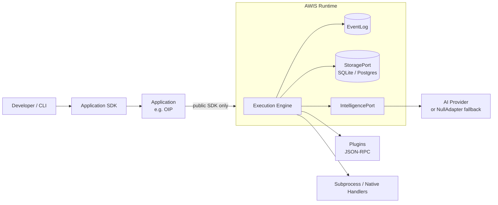

# AWIS

**AWIS** is a locally-hosted, AI-optional workflow execution runtime. It is the shared engineering foundation for building independent software products without rebuilding step execution, state persistence, failure recovery, and AI integration in every one of them.

AWIS is infrastructure, not an end-user product. Applications are built **on** AWIS; they define workflows and business logic, and AWIS runs them, records what happened, and recovers from failure.

**OIP** (Organizational Intelligence Platform) is the first application built on AWIS, living at `apps/oip` as a separate Go module. It validates the platform boundary: OIP consumes only the public SDK (`github.com/awis/awis/sdk`) and cannot reach into the runtime internals. Go's `internal/` visibility rule makes crossing that boundary a compile error, which gives AWIS and OIP a decoupling guarantee enforced by the compiler, not by convention.

---

## Why AWIS exists

Every non-trivial software product needs step execution with retry, durable state, failure recovery, AI integration behind a seam, and observability. Without a shared platform, each product builds its own version of this — slightly different, incompatible, and maintained in parallel. AWIS absorbs that cost once.

| Problem | How AWIS addresses it |
|---|---|
| Fragile scripts break on delay, retry, or human input | Workflows are durable, recoverable, and resumable by design |
| Workflow engines are hard to trace and change | Every execution is a complete, queryable event log (`awis trace`) |
| AI features are bolted on and vendor-locked | Intelligence sits behind a single provider-agnostic interface; the system runs fully without it |
| Every product reimplements the same infrastructure | One runtime, consumed through a stable SDK, shared across products |

---

## Core components

| Component | Role |
|---|---|
| **Step** | The atomic, idempotent unit of work — typed inputs, typed outputs, a handler (native code, subprocess, plugin, or AI call) |
| **Workflow** | A directed graph of Steps, defined in YAML or Go |
| **Execution Engine** | Runs steps, manages retries, failure recovery, compensation, and signals |
| **EventLog** | An append-only, durable record of every state change — the source of truth for `awis trace` and crash recovery |
| **StoragePort** | Durable storage abstraction; SQLite locally, Postgres-compatible in the cloud |
| **IntelligencePort** | Provider-agnostic AI seam; swapping providers is a config change, and removing all providers leaves a fully deterministic system |
| **Plugins** | External capabilities reached over a stdin/stdout JSON-RPC protocol, independent of the host language |
| **SDK** | The minimum public surface (`github.com/awis/awis/sdk`) applications use to define workflows and query history |

---

## Architecture



The runtime owns execution; applications own business logic. That boundary is structural — `internal/` visibility makes it impossible for an application to depend on AWIS internals instead of the SDK.

---

## Project structure

| Path | Contents |
|---|---|
| `cmd/` | CLI entrypoints |
| `sdk/` | Public, application-facing SDK |
| `internal/` | Runtime internals (engine, storage, intelligence, plugins) |
| `apps/` | Applications built on the platform (e.g. `apps/oip`) |
| `plugins/` | Plugin packages |
| `python/` | Python-side plugin and step support |
| `docs/` | Architecture, specifications, and the documentation index |
| `examples/` | Example workflows |
| `test/` | Validation and regression tests |
| `web/` | Web/GUI assets |

---

## Quick start

```bash
# Build
go build ./...

# Run tests
go test ./...

# Full verification (build, vet, lint, test, race)
make verify
```

---

## Documentation

| Topic | Location |
|---|---|
| Documentation index | [docs/README.md](docs/README.md) |
| CLI reference | [docs/CLI.md](docs/CLI.md) |
| Workflow schema | [docs/WORKFLOW_SCHEMA.md](docs/WORKFLOW_SCHEMA.md) |
| Event log format | [docs/EVENTLOG_FORMAT.md](docs/EVENTLOG_FORMAT.md) |
| Intelligence providers | [docs/PROVIDERS.md](docs/PROVIDERS.md) |
| Product requirements | [AWIS_PRD.md](AWIS_PRD.md) |
| Architecture blueprint | [AWIS_ARCHITECTURE_BLUEPRINT.md](AWIS_ARCHITECTURE_BLUEPRINT.md) |
