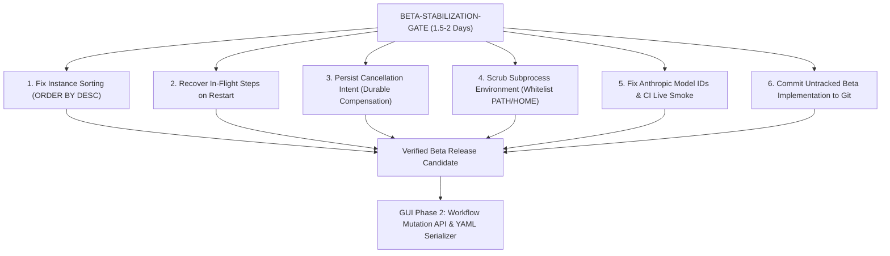

# Final Release Candidate Verdict: AWIS Beta

**Date:** 2026-09-03  
**Auditor:** Adversarial Release Verification Team  
**Evaluation Target:** AWIS Beta Release Candidate (`engine-hardening` @ `e75c1f1` + uncommitted API/GUI implementation)  
**Deliverable Type:** Release Candidate Challenge Phase Verdict

---

## 1. Is AWIS Beta Actually Release-Ready?

### **NO. AWIS Beta is NOT release-ready.**

Passing tests (`go test ./...` green across 28 packages) have created a **false perception of production readiness**. An adversarial challenge grounded in Tier 1 evidence (source code, database schema, and runtime execution paths) proves that the release candidate suffers from **3 Critical defects, 4 High-severity defects, and 4 Medium blockers**:

1. **Crash Deadlock on In-Flight Steps (Critical):** If an AWIS daemon or server restarts while a step is executing, the workflow instance is **deadlocked in `running` status forever**. The step claim in `step_claims` never expires, `hydrate()` ignores running steps, and the engine tick never re-dispatches them (`tick.go:198-202`, `hydrate.go:63-83`).
2. **Silent Compensation Bypass on Restart (Critical):** Cancellation intent (`reason`, `compensate`) is stored strictly in volatile RAM (`e.cancels`). A restart during cancellation resets this map to empty, causing `finalizeCancellation` to **silently skip the compensation plan entirely** and erase the cancellation reason (`cancel.go:204-215`).
3. **Inverted Dashboard Landing Page (Critical):** `ListInstancesPaged` executes `ORDER BY started_at, instance_id ASC` (oldest first). The GUI landing screen fetches page 1 and client-sorts the 50 oldest workflows. In any deployment with >50 instances, **active, running, or recently failed workflows are completely invisible on the dashboard** (`sqlite.go:812`, `instanceList.ts:96-125`).
4. **Host Secret Exfiltration via Subprocess Steps (High):** `SubprocessRunner` launches processes with `cmd.Env == nil`, leaking `ANTHROPIC_API_KEY`, cloud credentials, and database tokens to any subprocess workflow step (`subprocess.go:125-127`).
5. **Anthropic Integration Uses Fictional Model Names (High):** Model constants are hardcoded to `claude-haiku-4-5` and `claude-sonnet-5`, which do not exist in Anthropic's API and fail immediately with HTTP 404. Live tests were skipped in CI (`anthropic.go:34-36`, `live_test.go:28-34`).

Shipping AWIS Beta in this state will result in corrupted long-running workflows, uncompensated external state changes on restart, secret leakage, and an operational dashboard that fails its most basic user expectation.

---

## 2. Should Engineering Remain Focused on Engine Work?

### **YES — but ONLY for a narrow, time-boxed "Engine Stabilization Sprint" (1.5 to 2 engineering days).**

Engineering must **not** embark on open-ended engine refactoring, broad abstractions, or premature multi-user infrastructure. 

However, engineering **cannot** declare the engine "complete" and pivot 100% to GUI work today, because the engine currently has **fatal failure modes during normal crash/recovery cycles and process restarts**. The required engine work is strictly limited to resolving the release-blocking correctness, security, and recovery defects identified in `RELEASE_CANDIDATE_AUDIT.md`.

---

## 3. Should Focus Shift to GUI Work?

### **NOT YET for Phase 2 / Visual Builder work.**

Attempting to build workflow creation, workflow editing, visual drag-and-drop builders, or n8n-style canvases today is **premature and blocked**:
1. **Zero Write API:** The HTTP API contains zero `POST`, `PUT`, `PATCH`, or `DELETE` endpoints for workflows.
2. **Zero Serializer:** `yaml.Marshal` is called zero times in the Go codebase. Workflows can only be parsed, never saved back to disk.
3. **Immutable Storage:** `workflow_definitions` rejects duplicate versions (`ErrAlreadyRegistered`) and has no draft or staging state.
4. **Acyclic Constraints:** The engine and validator strictly prohibit graph cycles, making iterative loop constructs impossible without engine redesign.

The GUI Beta currently implemented (`web/`) is an operational read-only dashboard. It must be stabilized against the corrected backend pagination before any Phase 2 visual builder work begins.

---

## 4. What Is the Single Highest-Leverage Next Phase?

### **Phase Name:** `BETA-STABILIZATION-GATE`  
### **Duration:** 1.5 – 2 Engineering Days  
### **Scope:** Exactly 5 targeted fixes + 1 reconciliation action.

This is the single highest-leverage investment of engineering capacity. It eliminates every release blocker, protects against data loss and secret leakage, fixes the operational dashboard, and establishes an authoritative, committed release baseline.

### The 5 Targeted Fixes:

| # | Target File | Line Citation | Fix Action | Effort |
|---|---|---|---|:---:|
| **1** | `internal/storage/sqlite.go` | Line 812 | Change `ORDER BY started_at, instance_id` to `ORDER BY started_at DESC, instance_id DESC`. Remove client-side sorting hack in `instanceList.ts`. | **1 hour** |
| **2** | `internal/engine/hydrate.go` | Lines 63-83 | Detect steps in `CurrentSteps` whose last event was `StepStarted`. Recover them by emitting `StepFailed{code: "worker_crash"}` or scheduling attempt 1 retry. | **4 hours** |
| **3** | `internal/engine/cancel.go` & `migrations` | `cancel.go:129` | Store `reason` and `compensate` durably (or emit `WorkflowCancellationRequested`) so restarts preserve compensation. | **3 hours** |
| **4** | `internal/runner/subprocess/subprocess.go` | Line 125 | Assign sterile whitelist to `cmd.Env` (`PATH`, `HOME`, `LANG`), stripping all host process secrets (`ANTHROPIC_API_KEY`). | **1 hour** |
| **5** | `internal/intelligence/adapters/anthropic/anthropic.go` | Lines 34-36 | Replace fictional model IDs with real Anthropic IDs (`claude-3-5-haiku-20241022`, `claude-3-5-sonnet-20241022`). | **1 hour** |

### The Reconciliation Action:
Commit the working tree (including `cmd/awis-server`, `internal/api`, `internal/buildinfo`, `web`, and the fixes above) onto `engine-hardening`, tag `v0.1.0-beta`, and merge to `main`.

Once `BETA-STABILIZATION-GATE` is closed, the team can transition cleanly to **GUI Phase 2 Write Enablement** (`POST /api/v1/workflows` and the AST YAML serializer) with total confidence in engine correctness.
